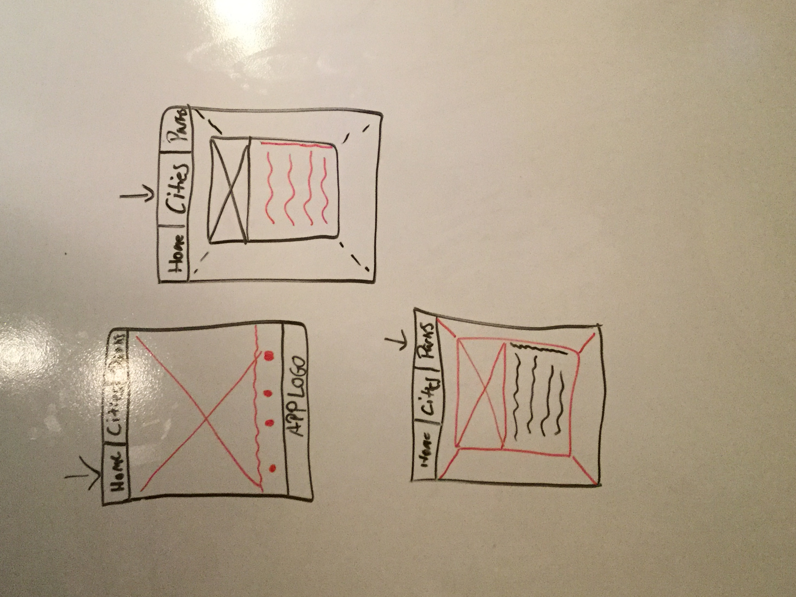

# The Competition App

#### A full crud web app designed to share sporting hot spots in new cities.

## Description
The compApp was created for the curious traveler. When traveling to a new city I was curious about where I could play a game of pick-up basketball at a park where I could find some competition. This app allows users to add, update, and review parks everywhere.

## Table of Contents
* [Technologies Used](#technologiesused)
* [Features](#features)
* [Design](#design)
* [Project Next Steps](#nextsteps)
* [Deployed App](#deployment)
* [About the Author](#author)

## Technologies Used
* JavaScript
* HTML5
* CSS3
* Axios
* Node.js
* MongoDB
* React.js
* Express.js

## Features
* Users can Create, Read, Update, and Delete cities or parks

## Whiteboard Images
*Original Whiteboard sketch

## Trello Planning
* Link to Trello: https://trello.com/b/8tFdzvLS/project-3-full-mern-app

## Design
* Design elements implemented using React.js. 

## Project Next Steps
* Users can change the theme.
* Users can leave comments on parks
* Park model will be nested in city model
* Users will be able to login to edit or post

## Deployed Link
[Netlify](https://compapp21.netlify.app)

* You can view the repository:
[Github.com](https://github.com/Gr8ness21/compApp)
* If unable to view run npm run dev in terminal

## About The Author
I build applications and mini projects tied to my various interests. I look for creative solutions to real world problems and think of technical ways to address them. While no application is ever perfect I find joy in the process and all my final products!

    
## Works Cited:
* N/A

## Special Colaborators:
* Branden White
* Andrea "Queen" Jamison
* Tremaine "Good Vibes" Lockhart
* Todd "East Atlanta Todd" Wilcher
* Destin
* Sekoya
* Omar
* Shannon
* Priya
* Cara